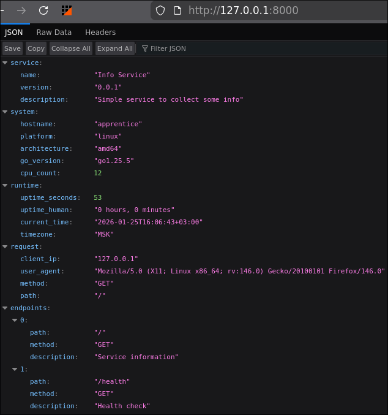
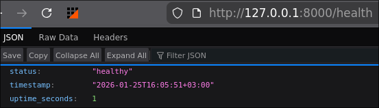
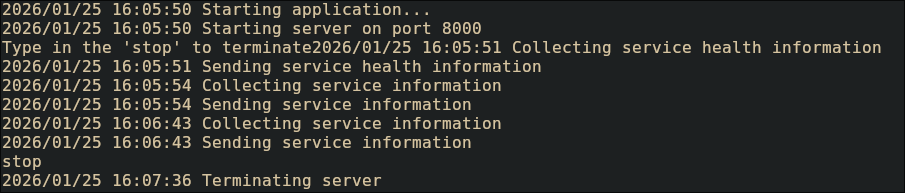

# API Documentation
- `GET /`: Returns service and system information
- `GET /health`: Returns health status of service


# Testing Evidence
## Images




## Terminal output samples
```
2026/01/25 16:02:23 Starting application...
2026/01/25 16:02:23 Starting server on port 8000
Type in the 'stop' to terminate
2026/01/25 16:02:28 Collecting service information
2026/01/25 16:02:28 Sending service information
2026/01/25 16:02:30 Collecting service health information
2026/01/25 16:02:30 Sending service health information
2026/01/25 16:02:32 Collecting service information
2026/01/25 16:02:32 Sending service information
2026/01/25 16:02:34 Collecting service health information
2026/01/25 16:02:34 Sending service health information
2026/01/25 16:02:37 Terminating server
```

With DEBUG=true
```
2026/01/25 16:02:47 Starting application...
2026/01/25 16:02:47 Starting server on port 8000
Type in the 'stop' to terminate
2026/01/25 16:02:49 Collecting service health information
2026/01/25 16:02:49 Sending service health information
2026/01/25 16:02:50 Collecting service health information
2026/01/25 16:02:50 Sending service health information
2026/01/25 16:02:53 Collecting service information
2026/01/25 16:02:53 Sending service information
2026/01/25 16:02:53 Collecting service information
2026/01/25 16:02:53 Sending service information
2026/01/25 16:02:54 Collecting service information
2026/01/25 16:02:54 Sending service information
Debug: main.go:136: Request: GET /health
Debug: main.go:136: Request: GET /health
Debug: main.go:103: Request: GET /
Debug: main.go:103: Request: GET /
Debug: main.go:103: Request: GET /
2026/01/25 16:02:56 Terminating server
```


# Challenges & Solutions
