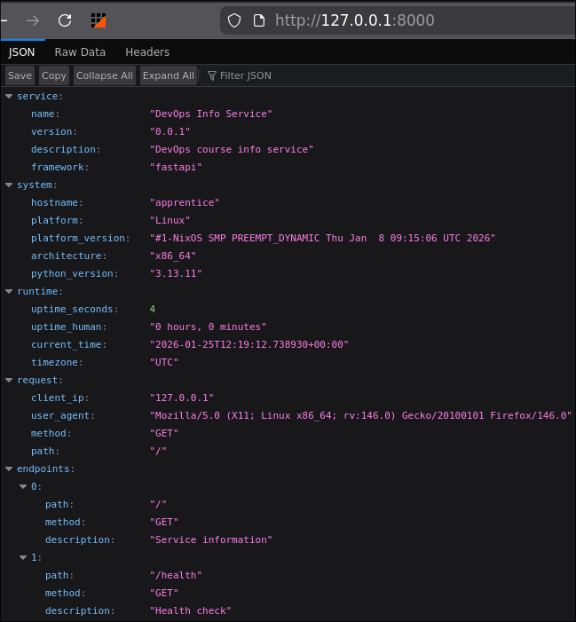
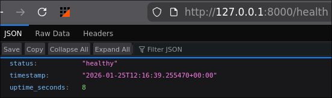
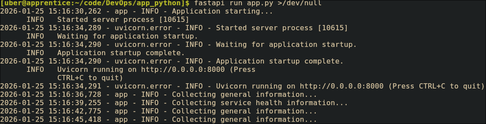

# Framework Selection
I have decided to use fastapi, because I already have experience using it
| Metric | Flask | Fastapi | Django |
|---|---|---|---|
| Used previously by me | no | yes | no |

# Practices Applied

# API Documentation
- `GET /`: Returns service and system information
- `GET /health`: Returns health status of service


# Testing Evidence
## Images




## Terminal output samples
Usual run (fastapi output voided)
```
2026-01-24 16:49:20,640 - app - INFO - Application starting...
2026-01-24 16:49:24,908 - app - INFO - Collecting general information...
2026-01-24 16:49:28,027 - app - INFO - Collecting service health information...
2026-01-24 16:49:30,292 - app - INFO - Collecting service health information...
2026-01-24 16:49:38,299 - app - INFO - Collecting general information...
```

Run with `DEBUG=true` (fastapi output voided)
```
2026-01-24 16:50:35,841 - app - INFO - Application starting...
2026-01-24 16:50:42,074 - app - INFO - Collecting general information...
2026-01-24 16:50:42,074 - app - DEBUG - Request: GET /
2026-01-24 16:50:45,150 - app - INFO - Collecting service health information...
2026-01-24 16:50:45,150 - app - DEBUG - Request: GET /health
2026-01-24 16:50:46,780 - app - INFO - Collecting general information...
2026-01-24 16:50:46,780 - app - DEBUG - Request: GET /
```

# Challenges & Solutions
During the preparation to the work, I encountered that my code editor (neovim) was not configured to work with python.

Therefore I had to research documentation and configure everything to set up and configure the LSP.


# GitHub Community
Starring repositories matters, because it encourage maintainers, attracts contributors and helps project gain visibility.

Foolowing matters, because it allows people to build professional connections, learn, collaborate and improve their career.
