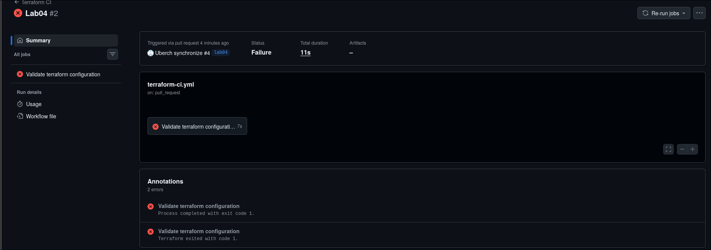

# Local VM
VM Provider: Virtual Box

Network: NAT with port forwarding (2222:22) to allow ssh

# Lab 5 Prep
VM for Lab 5:

No, I am not keeping VM

I will use local VM

# Bonus tasks

## Import process
**1. Installing GitHub Provider:**
**3. Create Personal Access Token:**
**4. Configure Token:**
**5. Configure Repository Resource:**
**6. Import**

## Terminal output of import

## Why import and benefits
Import brings existing resources into Terraform management:
1. Write Terraform config describing the resource
2. Run `terraform import` to link config to real resource
3. Terraform now manages that resource
4. Future changes go through Terraform

**Advantages of Managing Existing Resources with IaC:**
**1. Version Control:**
**2. Consistency:**
**3. Automation:**
**4. Documentation:**
**5. Disaster Recovery:**
**6. Team Collaboration:**
