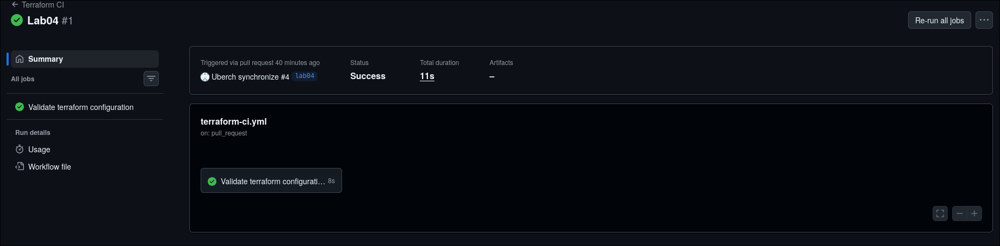

# Deployment Summary
## Worker URL
`https://infoservice.vam-molch.workers.dev`

## Main Routes:
- `/`: Main endpoint
- `/health`: Status info
- `/edge`: Info about client
- `/counter`: Counter of requests

## Configuration used

# Evidence


Example `/edge` JSON response:
```json
{
  "colo":"MCI",
  "country":"US",
  "city":"Kansas City",
  "asn":56971,
  "httpProtocol":"HTTP/2",
  "tlsVersion":"TLSv1.3"
}
```


# Kubernetes vs Cloudflare Workers Comparison

| Aspect | Kubernetes | Cloudflare Workers |
|--------|------------|--------------------|
| Setup complexity | Moderate | Low |
| Deployment speed | Slower (takes time to up containers) | Fast |
| Global distribution | Manual | Automatic |
| Cost (for small apps) | Cost of infrastructure | Free |
| State/persistence model | Stateful | Almost stateless |
| Control/flexibility | More | Less |
| Best use case | Big industrial applications | Simpler small projects |

# When to use each
## Scenarions favoring Kubernetes
- Complex or monolithic apps
- Stateful services
- Long-running processes
- Specific dependencies
- Hybrid or Multi-cloud strategy
## Scenarions favoring Workers
- Edge computing and low latency
- Stateless functions
- High variability and spike traffic
- No DevOps resources
- Fast development

# Reflection

- Setup is much easier than Kubernetes.
- Less flexibility in configuration is more constrained, than Kubernetes.
- No wide library of pre-build containers.
